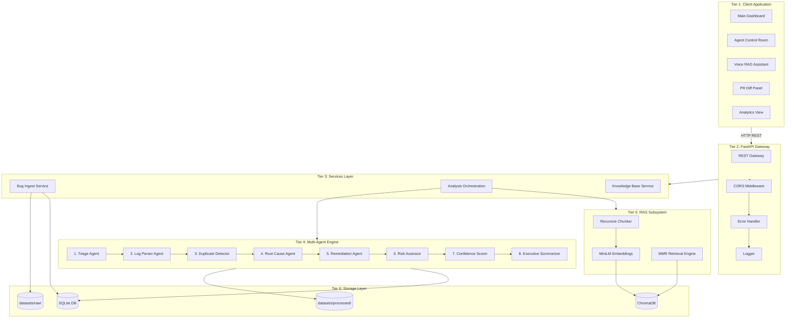

# 🛠️ Technical Documentation: AI Smart Bug Analyzer & Fix Advisor (ASBA)

---

## 📋 Table of Contents

1. [🎨 Technology Stack](#1-technology-stack)
2. [📐 System Design & Architecture](#2-system-design--architecture)
   - 2.1 [High-Level 6-Tier Design](#21-high-level-6-tier-design)
   - 2.2 [Component Interaction Flow](#22-component-interaction-flow)
   - 2.3 [Sequential Analysis Execution Model](#23-sequential-analysis-execution-model)
   - 2.4 [Retrieval-Augmented Generation (RAG) Subsystem](#24-retrieval-augmented-generation-rag-subsystem)
3. [🔌 REST API Specifications](#3-rest-api-specifications)
   - 3.1 [Endpoint Directory](#31-endpoint-directory)
   - 3.2 [API Payload & Lifecycle Profiles](#32-api-payload--lifecycle-profiles)
4. [⚙️ Setup & Installation Guide](#4-setup--installation-guide)
   - 4.1 [System Prerequisites](#41-system-prerequisites)
   - 4.2 [Local Backend Installation](#42-local-backend-installation)
   - 4.3 [Local Frontend Installation](#43-local-frontend-installation)
   - 4.4 [Docker Containerized Setup](#44-docker-containerized-setup)
5. [📘 User Guide](#5-user-guide)
   - 5.1 [Dashboard Interface Tab Mapping](#51-dashboard-interface-tab-mapping)
   - 5.2 [End-to-End User Journeys](#52-end-to-end-user-journeys)
   - 5.3 [Operational Fail-safe & Heuristics](#53-operational-fail-safe--heuristics)

---

## 1. 🎨 Technology Stack

The ASBA platform leverages a decoupled framework architecture to handle high-concurrency text ingestion and vector matching.

| Component Layer | Technology | Purpose | Target Version |
|:---|:---|:---|:---|
| **API Gateway** | FastAPI | Asynchronous REST Gateway, OpenAPI documentation generation | `0.109.0+` |
| **ASGI Server** | Uvicorn | High-performance server runner | `0.27.0+` |
| **Object Schema** | Pydantic | JSON payload parsing, type validation, dynamic models | `2.5.0+` |
| **Agent Orchestration** | LangChain | Sequential chain execution, LLM prompting context building | `0.1.0+` |
| **Base Language Model** | ChatOpenAI | Reasoning capabilities, code remediation generation (`gpt-4o-mini`) | `1.0.0+` |
| **Vector Store** | ChromaDB | Persistent database for embedding indexes | `0.4.22+` |
| **Dense Embeddings** | Sentence-Transformers | 384-dimensional vector encoding (`all-MiniLM-L6-v2`) | `2.3.0+` |
| **Relational Storage** | SQLite / SQLAlchemy | Incident registration logs, history audit trials, active states | `2.0.0+` |
| **Dashboard UI** | React / Vite | Interactive user portal with rapid dev cycles | `18.2` / `5.0` |
| **UI Telemetry** | Recharts | SVG renderers for telemetry statistics | — |
| **Parsing Utilities** | PyMuPDF / pdfplumber | Dynamic extraction from PDF formats | `1.23.0+` |
| | python-docx | Text extraction from Word document bug reports | `1.1.0+` |
| | lxml | XML validation and parsing utilities | `5.1.0+` |
| **Utilities** | Loguru | Rotating structured logging utility | `0.7.0+` |
| **Testing Core** | pytest | Unit, integration, and E2E scenario testing suites | `7.4.0+` |

---

## 2. 📐 System Design & Architecture

### 2.1 High-Level 6-Tier Design

The architecture isolates the client layer from data stores, executing computations in sequential agents.

```
┌────────────────────────────────────────────────────────────────────────┐
│  Tier 1: Client Application (React 18 + Vite)                          │
│  - Analytics Dashboard   - Agent Control Room   - Voice RAG Assistant  │
└───────────────────────────────────┬────────────────────────────────────┘
                                    │  Asynchronous JSON over REST
┌───────────────────────────────────▼────────────────────────────────────┐
│  Tier 2: API Gateway Layer (FastAPI)                                   │
│  - Endpoint Routers      - CORS Middleware      - Global Error Handler │
└───────────────────────────────────┬────────────────────────────────────┘
                                    │
┌───────────────────────────────────▼────────────────────────────────────┐
│  Tier 3: Service Layer                                                 │
│  - Bug Ingestion         - Analysis Service     - KB Loop Manager      │
└───────────────────────────────────┬────────────────────────────────────┘
                                    │
┌───────────────────────────────────▼────────────────────────────────────┐
│  Tier 4: Multi-Agent DAG Orchestration Engine                          │
│  - Sequential Agent Pipeline (Stages 1 through 8)                      │
└────────────────────┬──────────────────────────────┬────────────────────┘
                     │                              │
┌────────────────────▼─────────────────────┐  ┌─────▼────────────────────┐
│  Tier 5: Retrieval-Augmented Generation  │  │  Tier 6: Storage Engine  │
│  - Recursive Character Text Chunker      │  │  - SQLite (Metadata)     │
│  - MiniLM Embedding Model Encoder        │  │  - ChromaDB (Embeddings) │
│  - MMR Retrieval Engine                  │  │  - Local File System     │
└──────────────────────────────────────────┘  └──────────────────────────┘
```

---

### 2.2 Component Interaction Flow

The flow below details how components coordinate after a user submits a bug report:



---

### 2.3 Sequential Analysis Execution Model

The system utilizes an eight-stage sequential pipeline where each agent enhances the shared context:

```mermaid
flowchart LR
    Bug[Raw Bug Content] --> Triage[1. Triage Agent]
    Triage --> Log[2. Log Parser Agent]
    Log --> Duplicate[3. Duplicate Detection Agent]
    Duplicate --> RootCause[4. Root Cause Agent]
    RootCause --> Remediation[5. Remediation Agent]
    Remediation --> Risk[6. Risk Assessment Agent]
    Risk --> Confidence[7. Confidence Scoring Agent]
    Confidence --> Executive[8. Executive Summary Agent]
    Executive --> Output[Unified Analysis Response]
```



#### Detailed Agent Specifications:

> [!NOTE]
> Each agent can fall back to regular expression matches and heuristic templates if the OpenAI service becomes unreachable, guaranteeing 100% service uptime.

*   **Triage Agent:** Categorizes the issue's priority (critical, high, medium, low), severity (blocker, critical, major, minor, trivial), affected software component (api, database, payment, ui, network, auth, unknown), keyword tags, and suggested assignee team.
*   **Log Parser Agent:** Analyzes log lines using structured regular expression templates to extract error messages, stack trace logs, HTTP response codes, and timestamps.
*   **Duplicate Detection Agent:** Compares the new bug report's vector embedding against existing database vectors. If the similarity exceeds `0.82`, it flags the issue as a duplicate.
*   **Root Cause Agent:** Synthesizes triage info, stack trace output, and retrieved RAG contexts to determine the underlying failure category and mechanics.
*   **Remediation Agent:** Generates clean code patches (formatted as standard diff changes), step-by-step resolution workflows, and unit test code blocks.
*   **Risk Assessment:** Evaluates potential regression risks, deployment blast radius (low, medium, high, critical), and suggests recovery/rollback actions.
*   **Confidence Scorer:** Runs a mathematical check to compute an overall confidence rating based on key metric alignments across agents.
*   **Executive Summarizer:** Translates technical agent outputs into a concise summary narrative suitable for non-technical stakeholders.

---

### 2.4 Retrieval-Augmented Generation (RAG) Subsystem

The RAG subsystem matches new bug tickets with previously resolved incidents:

*   **Text Encoding:** Bug report bodies are parsed and converted into 384-dimensional dense vectors using the `all-MiniLM-L6-v2` transformer model.
*   **Document Chunking:** Input files are split using a recursive text chunker with a block size of 512 tokens and an overlap of 64 tokens.
*   **Retrieval Math:** Candidate items are queried from ChromaDB using Maximum Marginal Relevance (MMR) retrieval, balancing relevance and diversity:

$$\text{MMR} = \arg\max_{d_i \in R \setminus S} \left[ \lambda \cdot \text{Sim}_1(d_i, q) - (1-\lambda) \max_{d_j \in S} \text{Sim}_2(d_i, d_j) \right]$$

The value of $\lambda$ is set to `0.7` to balance similarity match relevance with semantic diversity.

*   **Learning Feedback Loop:** When a developer marks a bug ticket as fixed, the system encodes the resolution summary and pushes it back to the vector store to refine future search queries.

---

## 3. 🔌 REST API Specifications

The FastAPI gateway exposes a documented API layer. All requests validate incoming JSON payloads through Pydantic schemas.

### 3.1 Endpoint Directory

| HTTP Method | API Path | Request Schema | Response Schema | Description |
|:---:|:---|:---|:---|:---|
| `POST` | `/api/v1/bugs/submit` | `BugSubmitRequest` | `BugResponse` | Ingests plain text bug reports and registers them in SQLite. |
| `POST` | `/api/v1/bugs/upload` | Multipart File | `BugResponse` | Parses and stores uploaded log files or documents. |
| `POST` | `/api/v1/analyze` | `AnalyzeRequest` | `WorkflowResult` | Executes the 8-agent sequential RAG pipeline. |
| `GET` | `/api/v1/analysis/{id}` | — | `WorkflowResult` | Retrieves the stored analysis results by ID. |
| `GET` | `/api/v1/analysis/{id}/download` | Query String (`format`) | System File | Exports the compiled analysis in the requested file format. |
| `GET` | `/api/v1/history` | Query String (`limit`) | `HistoryList` | Retrieves the paginated analysis history records. |
| `GET` | `/api/v1/analytics/defect-patterns` | — | `DefectPatternResponse` | Returns aggregated component counts, severity statistics, and root-cause themes. |
| `POST` | `/api/v1/kb/feedback` | `KBFeedbackRequest` | `StatusResponse` | Indexes resolved bug resolutions into ChromaDB. |
| `GET` | `/api/v1/rag/query` | Query String (`q`) | `RAGQueryResponse` | Direct semantic search query interface for the vector store. |
| `GET` | `/api/v1/health` | — | `HealthStatus` | Confirms API availability. |
| `GET` | `/api/v1/status` | — | `SystemStatus` | Returns health statuses for SQLite and ChromaDB alongside database counts. |

---

### 3.2 API Payload & Lifecycle Profiles

#### Endpoint: Bug Submission
*   **Path:** `POST /api/v1/bugs/submit`
*   **Payload Schema:**
    *   `content` (String, Required): Text body of the bug ticket
    *   `title` (String, Optional): Short descriptive title
*   **Response Payload:**
    *   `success` (Boolean): Status indicator
    *   `bug` (Object): Metadata containing `id`, `title`, and `status`
    *   `analysis_id` (String): Pre-allocated analysis key

#### Endpoint: Workflow Analysis
*   **Path:** `POST /api/v1/analyze`
*   **Payload Schema:**
    *   `bug_id` (String, Required): ID of the ingested bug record
    *   `use_mmr` (Boolean, Optional): Flag to toggle MMR retrieval
    *   `retrieval_top_k` (Integer, Optional): Number of historical items to retrieve
*   **Response Payload:**
    *   `analysis_id` (String): Unique analysis identifier
    *   `triage` (Object): Contains priority, severity, component, assignee team, and tags
    *   `log_analysis` (Object): Contains error counts, HTTP codes, and stack traces
    *   `root_cause` (Object): Contains diagnostic category and underlying flaw details
    *   `remediation` (Object): Contains fix steps, code patch suggestions, and test plans
    *   `risk` (Object): Contains risk level, regressions, and rollback plans
    *   `confidence_score` (Float): Computed scoring index (0.0 to 1.0)
    *   `executive_summary` (String): High-level summary text

#### Endpoint: Knowledge Base Feedback
*   **Path:** `POST /api/v1/kb/feedback`
*   **Payload Schema:**
    *   `bug_id` (String, Required): Resolved bug database key
    *   `fix_summary` (String, Required): Text summary detailing the applied code fix
*   **Response Payload:**
    *   `success` (Boolean): Action status indicator
    *   `doc_id` (String): Key of the newly indexed document in the vector database

---

## 4. ⚙️ Setup & Installation Guide

### 4.1 System Prerequisites

Before installation, ensure your environment meets the following baseline requirements:

*   **Python:** Runtime environment versions `3.11.x` through `3.12.x`.
*   **NodeJS:** Execution runtime version `18.x` or higher with NPM.
*   **Hardware:** Minimum 4GB memory allocation (needed for CPU embedding execution).

---

### 4.2 Local Backend Installation

1.  **Navigate to the Backend Directory:**
    ```bash
    cd backend
    ```

2.  **Create and Activate Virtual Environment:**
    *   **Windows (PowerShell):**
        ```powershell
        python -m venv .venv
        .venv\Scripts\activate
        ```
    *   **macOS / Linux:**
        ```bash
        python -m venv .venv
        source .venv/bin/activate
        ```

3.  **Install Required Modules:**
    ```bash
    pip install -r requirements.txt
    ```

4.  **Create Environment File:**
    Copy the example configuration to a live environment file:
    *   **Windows:**
        ```powershell
        copy ../.env.example ../.env
        ```
    *   **macOS / Linux:**
        ```bash
        cp ../.env.example ../.env
        ```

5.  **Edit Environment Variables:**
    Open the `.env` file in your root folder and set your API keys and parameters:
    *   `LLM_API_KEY`: Set your OpenAI API key
    *   `DATABASE_URL`: Set database path to `sqlite:///asba.db`
    *   `CHROMA_PERSIST_DIR`: Vector store path set to `chroma_db`

6.  **Run Development Server:**
    ```bash
    uvicorn app.main:app --reload --host 0.0.0.0 --port 8000
    ```

---

### 4.3 Local Frontend Installation

1.  **Navigate to the Frontend Directory:**
    ```bash
    cd frontend
    ```

2.  **Install Frontend Node Packages:**
    ```bash
    npm install
    ```

3.  **Launch the Development Dashboard:**
    ```bash
    npm run dev
    ```
    The application will launch on your local host port: `http://localhost:5173`.

---

### 4.4 Docker Containerized Setup

For simple multi-container deployments using Docker:

1.  **Navigate to the Docker Directory:**
    ```bash
    cd docker
    ```

2.  **Build and Launch All Services:**
    ```bash
    docker compose up --build
    ```

> [!TIP]
> This command will spin up the backend API on port `8000` and the React interface on port `5173`, automatically mounting persistent volumes for the SQLite and ChromaDB data.

---

## 5. 📘 User Guide

### 5.1 Dashboard Interface Tab Mapping

The React frontend utilizes a tabbed dashboard structure:

*   **📑 Dashboard:** The main landing screen. Displays the current health state of dependencies, database sizes, and summaries of past issues.
*   **📤 Upload Bug:** The data entry screen. Features a drop zone for files (supporting `.txt`, `.log`, `.json`, `.xml`, `.md`, `.pdf`) and a text area for pasting reports.
*   **🔍 Analysis:** The pipeline status view. The **Agent Control Room** displays real-time updates and execution statuses of active agents.
*   **📊 Results:** The diagnostic report screen. Provides tabbed detail cards for agent outputs, including risk assessments, remediation steps, and code patches.
*   **📜 History:** The search index view. Contains a list of previously analyzed bugs with search, filtering, and export capabilities.
*   **⚙️ Settings:** The configuration page. Lists active environment configurations, embedding models, and analysis thresholds.

---

### 5.2 End-to-End User Journeys

Follow this end-to-end workflow to analyze a new bug report and update the knowledge base:

```
Step 1: Upload Incident File
  Navigate to "Upload Bug" → Drag & drop a log file or paste text → Click "Analyze Bug"
  ↓
Step 2: Track Pipeline Execution
  Watch active agent progress and inspect intermediate inputs on the "Analysis" screen
  ↓
Step 3: Review Analysis Results
  Inspect component classifications, risk evaluations, and copy self-healing patch diffs
  ↓
Step 4: Update Knowledge Base
  Submit the verified solution via the "Knowledge Base" panel to index it into ChromaDB
```

1.  **Ingestion:** Go to the **Upload Bug** tab. Paste your stack trace or drop a log file into the upload zone, then click **Analyze Bug**.
2.  **Tracking:** The system switches to the **Analysis** view. In this panel, you can watch the agents process in real time. Click on any agent node to inspect its inputs and outputs.
3.  **Reviewing:** Once completed, navigate to the **Results** screen to inspect the findings:
    *   Review component triage classifications, priority scores, and assignee recommendations.
    *   Examine extracted stack traces and exception signatures.
    *   Inspect proposed code changes in the green/red diff viewer. Click **Copy PR Patch** to copy the diff to your clipboard.
4.  **Feedback Loop:** After resolving the issue, go to the **Knowledge Base Explorer** in the UI. Enter the fix summary (e.g., *Reconfigured database pool size to 20 inside settings to prevent deadlock errors*), and click **Index Fix** to update the semantic search database.

---

### 5.3 Exception and Error Scenarios

The system includes automated fallbacks to handle infrastructure issues:

*   **Unsupported Formats:** Files with unsupported extensions (like `.jpg` or `.zip`) are blocked by the frontend, showing an error message.
*   **Storage Degradation:** If ChromaDB goes offline, the dashboard displays a yellow **Degraded** warning. The pipeline continues running, but duplicate detection and RAG lookups are bypassed.
*   **LLM API Failures:** If the OpenAI service times out or fails (e.g., due to invalid API keys), the orchestrator automatically runs offline fallbacks using regex and heuristic templates, displaying an fallback warning banner.
*   **API Offline State:** If the backend API disconnects, the frontend displays an **Offline** status and disables submission forms until connection is restored.

---

*Technical Documentation — AI Smart Bug Analyzer & Fix Advisor (ASBA)*
*Date: August 2026 | Version: 2.0*
