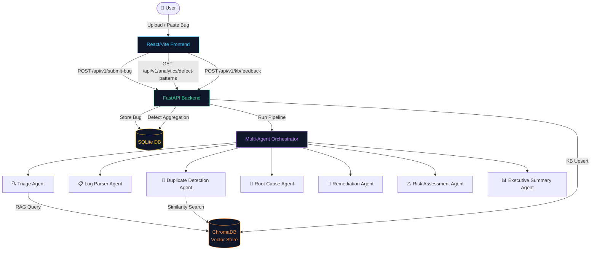
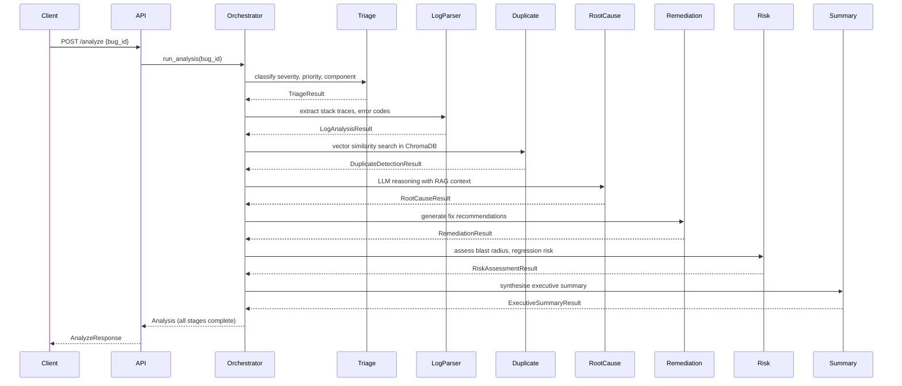

# TECHNICAL_DOCS.md –  Creation of Intelligent Bug Diagnosis Platform With Fix Recommendation Assistance

[](https://python.org)
[](https://fastapi.tiangolo.com)
[](https://react.dev)
[](https://www.trychroma.com)
[](LICENSE)

---

## Table of Contents

1. [Overview](#1-overview)
2. [Architecture](#2-architecture)
3. [Setup & Installation](#3-setup--installation)
4. [Core API Reference](#4-core-api-reference)
5. [Agent Workflow](#5-agent-workflow)
6. [Analytics Dashboard](#6-analytics-dashboard)
7. [Knowledge-Base Feedback Loop](#7-knowledge-base-feedback-loop)
8. [Test Suite](#8-test-suite)
9. [Metrics & Reporting](#9-metrics--reporting)
10. [Future Work](#10-future-work)

---

## 1. Overview

** Creation of Intelligent Bug Diagnosis Platform With Fix Recommendation Assistance** is a production-grade multi-agent system that:

- Accepts bug reports via file upload or pasted text.
- Runs a seven-stage LLM-powered analysis pipeline (triage → root cause → remediation → risk assessment → executive summary).
- Stores results in SQLite + ChromaDB for retrieval-augmented generation (RAG).
- Provides a React/Vite dashboard for interactive analysis, history review, real-time defect analytics, and a knowledge-base (KB) feedback mechanism.

---

## 2. Architecture



### Component Map

| Layer | Technology | Purpose |
|-------|-----------|---------|
| Frontend | React 18, Vite 5, recharts | Dashboard, upload, analytics |
| Backend | Python 3.11, FastAPI 0.109+ | REST API, agent orchestration |
| Database | SQLite + SQLAlchemy 2 | Persistent bug/analysis storage |
| Vector Store | ChromaDB 0.4+ | Embedding storage for RAG & KB feedback |
| Embeddings | sentence-transformers `all-MiniLM-L6-v2` | Text-to-vector encoding |
| LLM | OpenAI GPT-4o-mini (configurable) | Agent reasoning & output |
| Testing | pytest 7.4+ | Unit, integration, e2e test suite |

---

## 3. Setup & Installation

### Prerequisites

- Python ≥ 3.11
- Node.js ≥ 18
- (Optional) Docker + Docker Compose

### 3.1 Backend

```bash
# From the project root
cd backend
python -m venv .venv
# Windows
.\.venv\Scripts\activate
# macOS/Linux
source .venv/bin/activate

pip install -r requirements.txt

# Configure environment
cp ../.env.example ../.env
# Edit .env → set LLM_API_KEY, DATABASE_URL, etc.

# Start the API server
uvicorn app.main:app --reload --host 0.0.0.0 --port 8000
```

### 3.2 Frontend

```bash
cd frontend
npm install
npm run dev           # Development server at http://localhost:5173
# npm run build       # Production bundle (dist/)
```

### 3.3 Docker Compose

```bash
# From project root
docker-compose -f docker/docker-compose.yml up --build
```

### 3.4 Key Environment Variables

| Variable | Default | Description |
|----------|---------|-------------|
| `LLM_API_KEY` | *(required)* | OpenAI API key |
| `LLM_MODEL` | `gpt-4o-mini` | LLM model name |
| `DATABASE_URL` | `sqlite:/// Creation of Intelligent Bug Diagnosis Platform With Fix Recommendation Assistance...db` | SQLAlchemy database URL |
| `CHROMA_PERSIST_DIR` | `chroma_db` | ChromaDB persistence directory |
| `EMBEDDING_MODEL` | `sentence-transformers/all-MiniLM-L6-v2` | HuggingFace embedding model |
| `API_PREFIX` | `/api/v1` | API URL prefix |
| `CORS_ORIGINS` | `http://localhost:5173,...` | Allowed CORS origins |

---

## 4. Core API Reference

All routes are prefixed with `/api/v1` by default.

### Bug Submission

#### `POST /submit-bug`
Submit a bug report via multipart form (file upload or pasted text).

**Form fields:**

| Field | Type | Required | Description |
|-------|------|----------|-------------|
| `file` | File | ✗ | Log / trace file (`.txt`, `.log`, `.json`, `.pdf`, …) |
| `content` | string | ✗* | Pasted bug report text |
| `title` | string | ✗ | Human-readable title |
| `description` | string | ✗ | Optional longer description |
| `component` | string | ✗ | Affected system component |
| `tags` | string | ✗ | Comma-separated tags |

> \* Either `file` or `content` must be provided.

**Response `200`:**
```json
{
  "success": true,
  "message": "Bug submitted successfully.",
  "bug": { "id": "...", "title": "...", "status": "submitted", ... },
  "analysis_id": "..."
}
```

---

#### `POST /analyze`
Trigger the multi-agent analysis pipeline for a previously submitted bug.

**Body:**
```json
{ "bug_id": "...", "use_mmr": true, "retrieval_top_k": 5 }
```

**Response `200`:** Full `AnalysisResponse` with all agent outputs.

---

### Bug & Analysis Retrieval

| Method | Path | Description |
|--------|------|-------------|
| `GET` | `/bug/{bug_id}` | Retrieve a specific bug report |
| `GET` | `/analysis/{analysis_id}` | Retrieve analysis results |
| `GET` | `/analysis/{analysis_id}/download?format=pdf` | Download report (PDF/MD/TXT) |
| `GET` | `/history?limit=50&offset=0` | Paginated analysis history |

---

### Analytics (NEW – Milestone 4)

#### `GET /analytics/defect-patterns`
Aggregate defect pattern statistics from all stored bugs.

**Response `200`:**
```json
{
  "success": true,
  "top_components": [
    { "component": "Auth/LoginService", "count": 12 }
  ],
  "severity_distribution": [
    { "severity": "Critical", "count": 5 },
    { "severity": "High", "count": 8 }
  ],
  "root_cause_themes": [
    { "theme": "Null / Undefined Reference", "count": 7 },
    { "theme": "Network / Timeout", "count": 3 }
  ]
}
```

---

### Knowledge-Base Feedback (NEW – Milestone 4)

#### `POST /kb/feedback`
Store a resolved-bug fix embedding in ChromaDB for future RAG retrieval.

**Body:**
```json
{
  "bug_id": "550e8400-e29b-41d4-a716-446655440000",
  "fix_summary": "Move network calls off the UI thread using Kotlin Coroutines."
}
```

**Response `200`:**
```json
{
  "success": true,
  "message": "Fix embedding stored successfully for bug 'Crash on login'.",
  "doc_id": "b3f8a1c2-...",
  "bug_id": "550e8400-...",
  "timestamp": "2024-03-15T12:00:00+00:00"
}
```

**Error Responses:**

| Status | Condition |
|--------|-----------|
| `404` | `bug_id` not found in database |
| `422` | `fix_summary` too short (< 5 chars) |
| `503` | Embedding model or ChromaDB unavailable |

---

### System Endpoints

| Method | Path | Description |
|--------|------|-------------|
| `GET` | `/health` | Liveness probe |
| `GET` | `/status` | Detailed service status (ChromaDB, embeddings) |
| `GET` | `/settings` | Current application settings |

---

## 5. Agent Workflow

The analysis pipeline runs seven agents sequentially, each enriching a shared `Analysis` object:



### Agent Descriptions

| Agent | Purpose | Output Fields |
|-------|---------|---------------|
| **Triage** | Classifies severity, priority, component, affected users | `severity`, `priority`, `component`, `affected_users` |
| **Log Parser** | Extracts stack traces, error codes, timestamps | `error_type`, `stack_frames`, `line_number` |
| **Duplicate Detection** | Queries ChromaDB for similar historical bugs | `is_duplicate`, `similar_bugs`, `similarity_score` |
| **Root Cause** | LLM reasoning + RAG to identify the underlying defect | `root_cause`, `contributing_factors`, `evidence` |
| **Remediation** | Generates ranked fix recommendations with code snippets | `fixes`, `code_examples`, `estimated_effort` |
| **Risk Assessment** | Grades deployment risk, regression probability, rollback plan | `risk_level`, `regression_risk`, `rollback_steps` |
| **Executive Summary** | One-page summary for stakeholders | `summary`, `key_findings`, `action_items` |

---

## 6. Analytics Dashboard

The **Analytics** panel (accessible via the sidebar) visualises defect patterns in real time.

### Data Source
All charts fetch from `GET /api/v1/analytics/defect-patterns`.

### Charts

| Chart | Type | Data |
|-------|------|------|
| Top Affected Components | Recharts `BarChart` | Bug count per component |
| Severity Distribution | Recharts `PieChart` (donut) | Bug count per priority level |
| Root-Cause Themes | Weighted tag cloud | Recurring failure patterns extracted from agent `root_cause` JSON |

### Theme Extraction Algorithm
The analytics route scans the `root_cause` JSON column in the `analyses` table and maps keywords to ten predefined themes:

- Null / Undefined Reference
- Memory Issues
- Concurrency / Race Condition
- Network / Timeout
- Database / Query Error
- Authentication / Auth
- Configuration / Environment
- Type / Schema Mismatch
- File / IO Error
- Dependency / Import Error

Bugs whose root cause matches none of the above are counted under **Other**.

---

## 7. Knowledge-Base Feedback Loop

The KB feedback mechanism closes the learning loop so that successfully resolved bugs improve future RAG retrievals.

### Flow

```
POST /api/v1/kb/feedback
        │
        ├─► Validate bug_id exists (SQLite)
        │
        ├─► EmbeddingService.embed_query(fix_summary)
        │         └─ sentence-transformers all-MiniLM-L6-v2
        │
        └─► ChromaDB.upsert( collection="resolved_fixes" )
                  metadata = { bug_id, fix_summary (truncated 500 chars), timestamp }
```

### ChromaDB Collections

| Collection | Purpose |
|-----------|---------|
| ` Creation of Intelligent Bug Diagnosis Platform With Fix Recommendation Assistance` | Bug knowledge base for duplicate detection & RAG |
| `resolved_fixes` | Fix embeddings submitted via KB feedback endpoint |

### RAG Integration (Future)
The `resolved_fixes` collection can be queried by the **Remediation Agent** to surface proven fixes from the same codebase before generating new suggestions.

---

## 8. Test Suite

### Structure

```
backend/tests/
├── conftest.py                  # Shared session fixtures (DB, client, paths)
├── test_api.py                  # Core API route tests
├── test_database.py             # SQLAlchemy model tests
├── test_milestone_2.py          # Milestone 2 regression tests
├── test_parsers.py              # File parser tests (PDF, DOCX, log)
├── test_rag.py                  # Embedding & ChromaDB tests
└── e2e/
    ├── conftest.py              # E2E fixtures & bug content templates
    ├── test_ui_thread_error.py  # ANR / UI Thread violation scenario
    ├── test_json_parser.py      # JSON parse / schema mismatch scenario
    ├── test_db_concurrency.py   # Database deadlock scenario
    ├── test_network_timeout.py  # Socket timeout scenario
    └── test_memory_oob.py       # Out-of-memory / heap space scenario
```

### Running Tests

```bash
cd backend

# Run all tests
pytest -q

# Run e2e tests only (verbose)
pytest tests/e2e/ -v

# Run with coverage report
pytest --cov=app --cov-report=term-missing -q

# Run a specific scenario
pytest tests/e2e/test_memory_oob.py -v
```

### E2E Test Scenarios

Each e2e test file follows the same three-phase structure:

1. **Submit** – POST a synthetic bug report and assert HTTP 200 + bug ID.
2. **Analytics** – GET `/analytics/defect-patterns` and assert the new entry is reflected.
3. **KB Feedback** – POST to `/kb/feedback` (ChromaDB upsert **mocked**) and assert 200 + `doc_id`.

| Test File | Bug Type | Component |
|-----------|----------|-----------|
| `test_ui_thread_error.py` | ANR / NetworkOnMainThreadException | MobileApp/NetworkLayer |
| `test_json_parser.py` | JsonParseException / Schema mismatch | API/PayloadParser |
| `test_db_concurrency.py` | MySQL Deadlock | Database/TransactionManager |
| `test_network_timeout.py` | SocketTimeoutException | PaymentService/ExternalGateway |
| `test_memory_oob.py` | OutOfMemoryError / Java heap | ReportEngine/LargeDataExport |

### Test Isolation
All tests use `tmp_path_factory` to redirect SQLite and ChromaDB paths to temporary directories, preventing cross-contamination with developer data.

---

## 9. Metrics & Reporting

### Analysis Report Formats

Reports are downloadable via `GET /analysis/{id}/download?format=<fmt>`:

| Format | MIME Type | Description |
|--------|-----------|-------------|
| `txt` | `text/plain` | Plain-text summary |
| `md` | `text/markdown` | Full markdown report |
| `pdf` | `application/pdf` | PDF (generated via PyMuPDF/pdfplumber) |

### Key Performance Indicators

| Metric | Target |
|--------|--------|
| Analysis pipeline latency | < 30 s end-to-end |
| Duplicate detection precision | > 80% at cosine distance ≤ 0.25 |
| Embedding throughput | ≥ 50 documents/sec (CPU) |
| API response time (submit-bug) | < 500 ms (excl. LLM call) |
| Test suite pass rate | 100% |

---

## 10. Future Work

| Area | Idea |
|------|------|
| **RAG Enhancement** | Query `resolved_fixes` collection in the Remediation Agent to surface proven internal fixes before calling the LLM |
| **Streaming Analysis** | Stream agent outputs to the frontend via Server-Sent Events for real-time progress |
| **Authentication** | Add JWT/API-key auth for multi-tenant deployments |
| **Webhook Integrations** | POST analysis results to Jira, GitHub Issues, or Slack |
| **Fine-tuning** | Periodically fine-tune the embedding model on domain-specific bug vocabulary |
| **Analytics Trends** | Time-series analytics (bugs/week, MTTR) with date-range filters |
| **Vector Store Scaling** | Migrate from ChromaDB SQLite backend to Qdrant or Weaviate for production scale |
| **Automated Regression** | Auto-detect regression risk by comparing new bug embeddings with release-tagged historical bugs |

---

*Generated: 2026-08-05 | Version: 1.0.0 | Authors:  Creation of Intelligent Bug Diagnosis Platform With Fix Recommendation Assistance Team*
